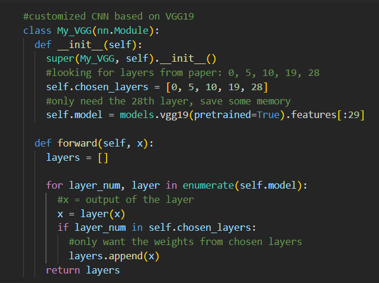
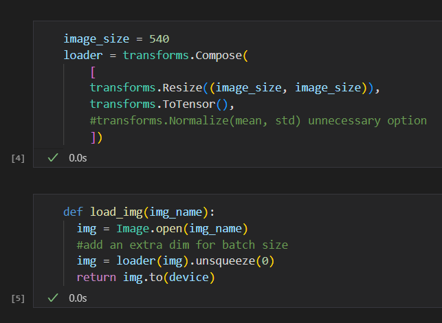
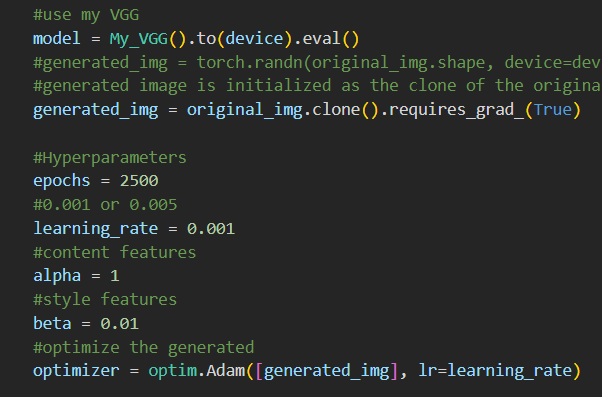

# project-4---Xiang-Li 

# Neural Style Transfer

* The whole idea of neural style transfer is to create a new image that has the mixed features from both original image and style image.

* The orginal research paper was published in 2015.

* In the paper, the researchers create a customized model from 5 conv layers in the original vgg 19 model. (conv 1-1, 2-1, 3-1, 4-1, 5-1).

* It is quite easy to implement this in the code.

* Before the training, we need some functions to process the images.

* The hyperparameter settings

* The idea of the training process is to reduce the difference between the generated image and the content image and the style image.
* To minimize the total loss, the generated image will be a better mix of both original and style image.
* Math function for guidance.

* The code implementation

* Some nice results!

# Stable Diffusion Prompt Engineering through Web Application

* Stable Diffusion prompt engineering and demo through stable diffusion api.
* The version of the Stable Diffusion used here is v1.5 from huggingface.com.
* manual_seed(42) is used to control the testing result.
* DPMSolverMultistepScheduler from diffuser library is used to reduced the decoding looping from 50 to 25.
* AutoencoderKL is a variational autoencoder to improved the quality of the generated image.

* The text prompt is explained into three parts: the initial input, details, and cues.
* The intial input is a common description of the specific thing we want the model to generate.
* The details is the part where want the thing to be as specific as possible.
* The cues is the techinical specification of the generated image.

* An example of result after fine tuned the model.

# Image interpolation with Stable Diffusion

* Testing Image interpolation with Stable Diffusion using two functions through its API.
* Slerp function: it works by finding the shortest path between two rotations on the surface of a sphere and interpolating between them2. This results in a smooth and natural transition between rotations, making it ideal for animations and camera movements2.

* Sin/cos 0 - 2pi transition, start by moving from 0 to 2π and at each step we add the cosine of x and the sine of y to the result. Using this approach, at the end of our movement we end up with the same noise values ​​that we started with.

* Some test results.

# Neural Network training with MNIST dataset

* The dataset is in .csv format, so it is read by Pyspark.

* Transfer the dataframe to pandas dataframe.

* Change the datatype of the dataframe from object to float32.

* Assign the X training set and Y label.

* Transform the data and assign labels, and assemble the model.

* Transform the data and assign labels, and assemble the model.

* Reaching an accuracy of 95.8% which is lower than standard CNN models.
